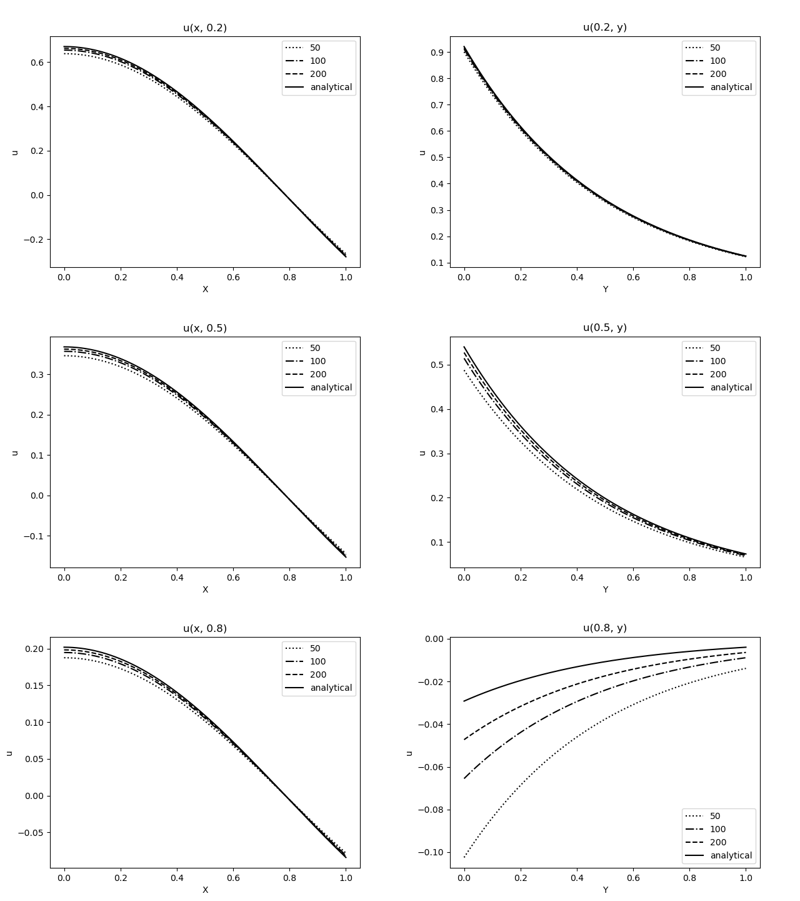

# Laplace na stvorci

Riesene pomocou metody konecnych diferencii.
Linearny system bol rieseny iterativnou metodou konjungovanych gradientov.

Analyticke riesenie je mozne ziskat metodou separacie premennych a je: `cos(2x) exp(-2y)`.

2D mapy vyzeraju, ze sa lisia pre rozne velkosti meshu, je to sposobene len inou farebnou skalou (ktoru si Gnuplot nastavil automaticky).
Je to vidiet z grafov pre rezy, ktore vykazuju zhodu.

Konvergencia je druheho radu, ako je vidiet z fitu.
