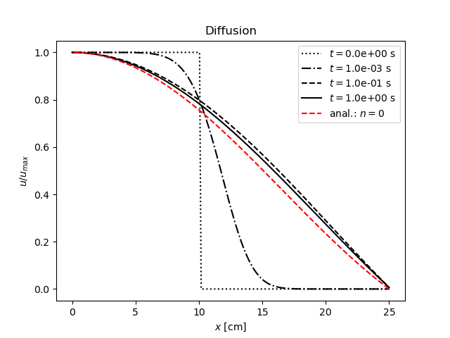

# Metoda priamok

Difuznu rovnicu s rekombinaciou semi-diskretizujem ako:

\begin{equation}
    \frac{\rm{d} u_i}{\rm{d} t} = D_{\rm{a}} 
            \left(
                    \frac{1}{x_i} \frac{u_{i+1} - u_{i-1}}{2 \Delta x} + \frac{u_{i-1} - 2 u_i + u_{i+1}}{\Delta x^2} 
            \right)
            - \alpha u_i^2
\end{equation}

co je sustava ODR, ktore je mozne numericky integrovat.

Na ose valcove nadoby ($i = 0$) davam okrajovu podmienku symetrie,
 na okraji domeny ($i = N$) predpokladam stenu nadoby,
 na ktorej iony a elektrony rekombinuju instantne (zjednodusenie,
 ale na tejto okrajovej podmienke snad vysledok zalezat nebude) - koncentraciu davam nulovu.
Prva okrajova podmienka je Neumann-ovho typu - derivacia je nulova, druha je Dirichletova.

To sa prejavi v diskretizacii nasledovnym sposobom:

\begin{gather}
    0 = \frac{\partial u}{\partial x} \lvert_{x=0} \approx \frac{u_{-1} - u_{1}}{\Delta x} \qquad \rightarrow \qquad
    u_{1} = u_{-1} \qquad \rightarrow \nonumber \\
    \frac{u_{-1} - 2 u_0 + u_{1}}{\Delta x^2} = \frac{-2 u_0 + 2 u_{1}}{\Delta x^2} \\
    \frac{u_1 - u_{-1}}{2 \Delta x} = 0 \\
    \frac{\rm{d} u_0}{\rm{d} t} = D_{\rm{a}} \frac{-2 u_0}{\Delta x^2} - \alpha u_0^2
\end{gather}

Pre opacny koniec:
\begin{gather}
    \frac{\rm{d} u_{N-1}}{\rm{d} t} = D_{\rm{a}} 
        \left(
            \frac{u_{N-2} - 2 u_{N-1}}{\Delta x^2} +
            \frac{u_{N-2}}{2 x_{N-1} \Delta x}
        \right)  - \alpha u_{N-1}^2
\end{gather}

# Analyticke riesenie pre diffuznu rovnicu

V  gulovej geometrii by som ocakaval riesenie v sferickych Besselovych funckciach. Nulty mod by odpovedal funkcii $\frac{\sin x}{x}$.

# Vysledky

Nulty mod je naskalovany v $x$ a $y$ osi.

